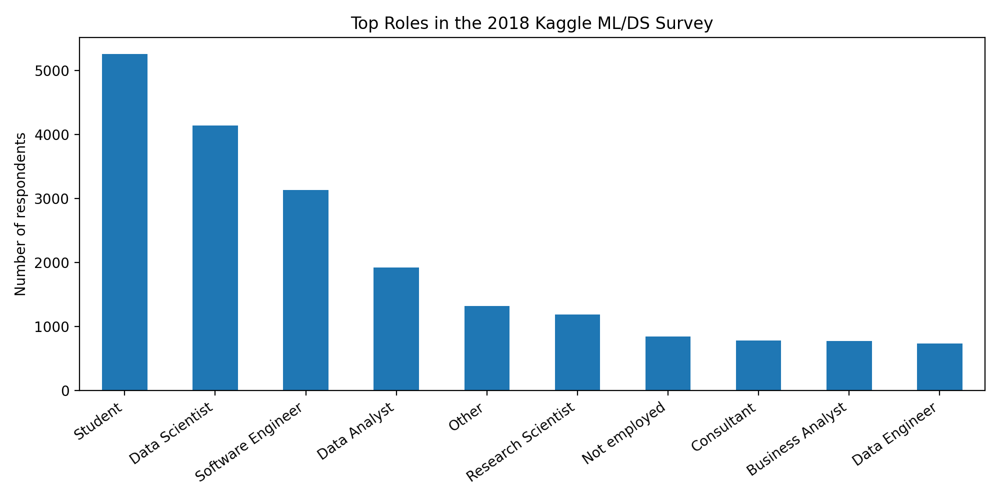
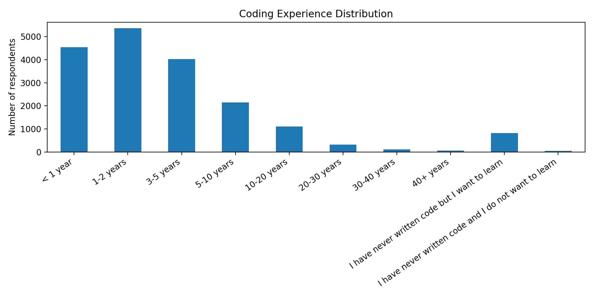
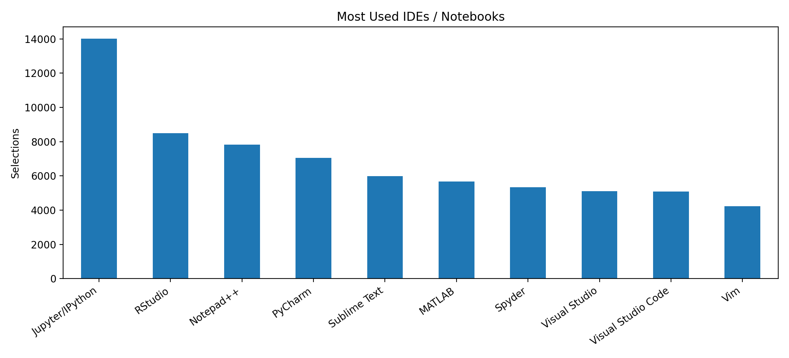
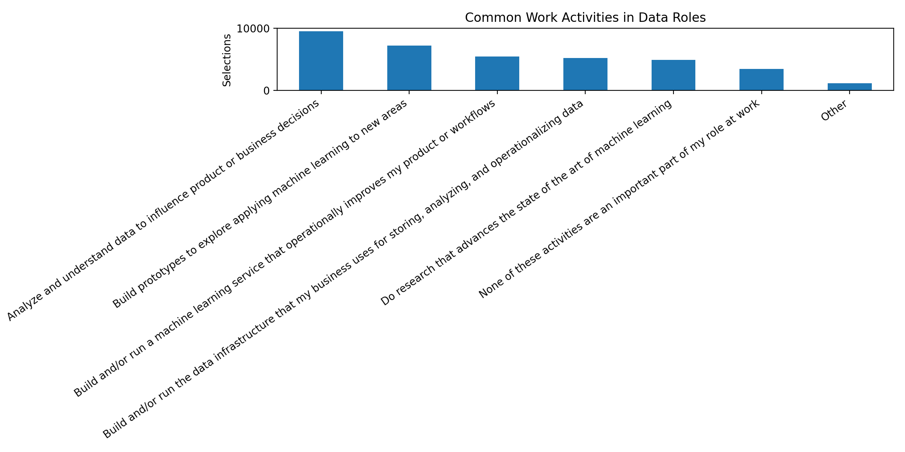

# AI Usage & Behavioral Patterns Analysis (23K+ Real Survey Responses)

Analyzed 23,000+ real responses from the Kaggle Data Science Survey to uncover how experience level, roles, and tools shape AI usage and decision-making.

Understanding how AI and data-science workflows shape behavior, tools, and career paths.

## Overview
This project analyzes the **2018 Kaggle Machine Learning & Data Science Survey** using real public survey data. It focuses on respondent roles, coding experience, tool usage, and common work activities, then turns those findings into clean charts and a simple dashboard.

## Files
- `analysis.py` — main Python script that generates charts and a summary report
- `app.py` — Streamlit dashboard
- `kaggle_survey_2018_multiple_choice_responses.csv` — included Kaggle dataset
- `outputs/` — generated charts and summary report
- `requirements.txt` — packages needed to run the project

## Sample Output Files
After running `analysis.py`, the project creates:
- `outputs/01_top_roles.png`
- `outputs/02_coding_experience.png`
- `outputs/03_ide_usage.png`
- `outputs/04_work_activities.png`
- `outputs/summary_report.txt`
- 
## Data Source

Kaggle: 2018 Data Science & Machine Learning Survey  
https://www.kaggle.com/datasets/kaggle/kaggle-survey-2018

## How to Run in PyCharm
Open the folder in PyCharm, then run these commands in the terminal:

```bash
python3 -m pip install -r requirements.txt
python3 analysis.py
python3 -m streamlit run app.py
```

## Resume-Ready Description
Built a Python project using real Kaggle survey data to analyze data-science roles, coding experience, tool usage, and work-activity patterns, then presented insights through visualizations and a dashboard.

## Why This Project Is Strong
- Uses **real public data**
- Shows Python, pandas, matplotlib, and Streamlit
- Gives you a clean portfolio piece for internships
- Lets you discuss real insights instead of fake sample outputs

- ## Sample Visualizations





